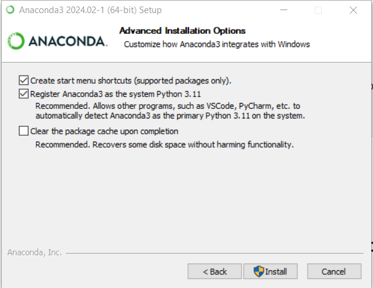
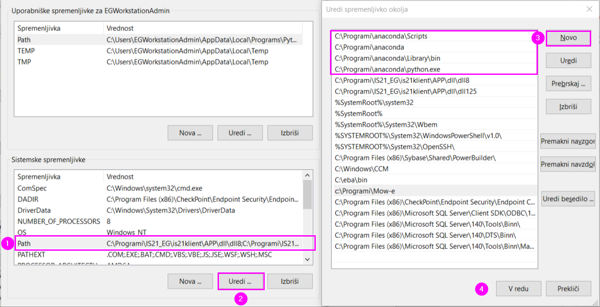
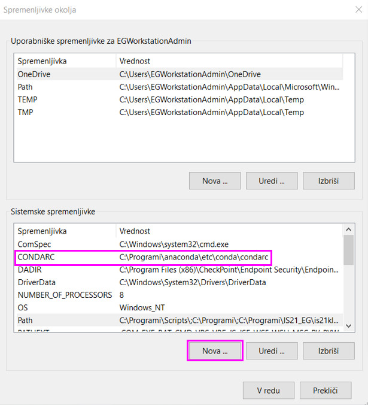

# Setting Up Your Work Environment

## Downloads for Your Work Environment

Download the following tools for your work environment:
- [Python](https://www.python.org/downloads/release/python-3913/), version 3.10 is also acceptable (optional python also comes with Anaconda),
- [Anaconda](https://www.anaconda.com/download) (Skip email registration, right bottom corner),
- [VSCode](https://code.visualstudio.com/download) (IDE)
- [Git](https://git-scm.com/downloads) (version control)
- [Notepad++](https://notepad-plus-plus.org/downloads/) (QOL text editor)

**Don't install just yet!**

## Available Software on Your Computer

The Software Center includes:
- SSMS/SQL Management Studio, for database access
- QGIS, an open-source GIS program
- Greenshot, for screenshots
- ABBYY FineReader PDF, for editing PDFs
- Adobe Acrobat, for PDFs
- 7-Zip, for zip files

## Web applications used:

We use different web applications like:
- monday.com
- ChatGPT
- Medium

## Already Installed

- Microsoft Office
- Microsoft Outlook
- Microsoft Teams (for teams you need to be added to additional groups of our worklpace like RD EG by Blaž, there are also documents of our projects)

## Installation

###### Disclaimer: Most likely you will still have to add all the PATH-s into system variables manually! 


1. Request administrative access via the user support portal or contact Rok Andolšek/ Ares Osrednikar on Microsoft Teams.
2. Use the username (AD\Workstationadmin) and password during installation when prompted for credentials. If the installation doesn't start, right-click > Run as Administrator.
###### If by any chance you do not recieve the question for the admin log in by windows while running an setup you migh have to log into your laptop with the Admin user and password to change some right.

3. Install all programs in `C:\Programi\` for anaconda create a folder anaconda `C:\Programi\anaconda` before or during the installation because the installer will say that the folder is not empty, select to install for ALL USERS and check "ADD to path" where it is possible. For Anaconda, you can do the same thing or add the PATH manually later under system variables.




## Anaconda configuration

###### Disclaimer: Conda only works with powershell and not CMD because of group policies

After the installation you have to complete the following steps:

1. Add The following PATH-s into your system variables (Urejanje spremenljivk delovnega okolja):

* C:\Programi\anaconda
* C:\Programi\anaconda\Scripts
* C:\Programi\anaconda\Library\bin
* C:\Programi\anaconda\python.exe



2. Move all the paths to the top as seen on the picture above.

3. Edit the `C:\Programi\anaconda` folder permissions. Right-click the folder and select properties > security, then click on the "Edit" button. In the new window select the "Users (EGxxxxNB\Users)" group. Finally, allow the following options: Modify, Read & execute, List folder contents, Read, Write.

4. Open VSCode in `C:\Programi\anaconda\etc\conda`. Create a new file named `condarc` (no file type). It serves as a global configuration file for your computer. Paste the following text into the file and hit save:

```
channels:
  - defaults
envs_dirs:
  - C:\Programi\anaconda\envs
pkgs_dirs:
  - C:\Programi\anaconda\pkgs
``` 


5. Add CONDARC as a system variable into system variables as in the picture below 



6. Firstly run `conda init` in powershell CLI , create test environment with your python version from anaconda`conda create --name test_env python=3.11`, afterward use `conda activate test_env ` and check that `pip install pandas` in powershell works.

## Git configuration

Add The following PATH-s into your system variables (Urejanje spremenljivk delovnega okolja):

 * C:\Programi\Git\bin
 * C:\Programi\Git\cmd


## Running Code

Run the code in a folder that is not on OneDrive; otherwise, you will get an error stating that you do not have access in the terminal. We suggest `C:\Programi\projects`.

## Database Access

You need to request permission to connect to the Datawarehouse, which contains a collection of data from multiple databases.

Blaž Dobravec manages permissions and submits access requests through Einformatik, considering NDA due to GDPR to ensure data is not exported to personal computers.

Open SSMS and connect to the server `SRVEGBIDB01p` with the default user `EGxxxx`. Under databases, find `DW.star`. Access to other databases is restricted. For more information on `DW.star`, see [sql_dwh_basics.md](06_sql_dwh_basics.md).

## Python Libraries

The use of `pip install` only works outside the corporate network; otherwise, you will get an SSL error. Therefore, use WiFi.

## Github

Inform Blaž Dobravec of your Github username so you can be added to different repositories from [EG-ResearchAndDevelopment](https://github.com/EG-ResearchAndDevelopment).
